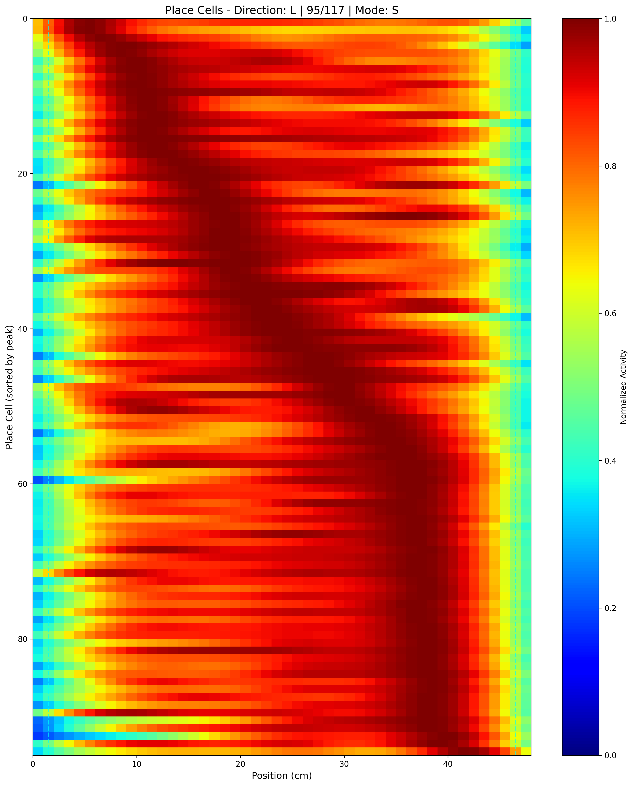

# pipeline4onePhoton


A CLI pipeline for one-photon spatial coding analysis with v4 miniscope recordings, behavior tracking, and NIDQ synchronization signals. Pipeline4onePhoton merges different types of data into one format by synchronizing the timeline. It also provides several analysis functions for filtering spatial-coding cells and visualization of downstream analysis.

## Overview

This pipeline processes multi-modal neuroscience data:
- **Miniscope videos**: Calcium activity from one-photon microendoscope
- **Webcam videos**: Behavioral tracking via DeepLabCut
- **NIDQ signals**: Digital synchronization and event markers

```
Pipeline Overview:
                    A (CSV)
                       |
                       v
  B (MAT) -----> D (Merge) -----> E (Extract) -----> F (Analyze)
                       ^                     |                      |
                       |                     v                      v
                    C (NIDQ)         Downstream MAT        Place field plots
                                         (active cells)           + results MAT
```

## Example Output

### Place Cell Heatmap (Left Direction)
Place fields sorted by peak location, showing spatial tuning of identified place cells:




## Installation

### From source (recommended)

```bash
# 1. Clone the repository
git clone https://github.com/ylemnox/pipeline4onePhoton.git
cd pipeline4onePhoton

# 2. Create and activate virtual environment
python3 -m venv venv
source venv/bin/activate

# 3. Install the package
pip install -e .

# 4. Verify installation
pipeline4onePhoton info
```

### For Pipelines A and B (External)

Pipelines A (DeepLabCut) and B (CNMF-E) must be run externally via Jupyter notebooks:

- **Pipeline A**: `notebooks/SingleMouseTracking_via_DeepLabCut.ipynb` - Run on Google Colab
- **Pipeline B**: `notebooks/cnmfE_pipeline.ipynb` - Run on Google Colab (GPU recommended)

See [docs/pipeline_a_deeplabcut.md](docs/pipeline_a_deeplabcut.md) and [docs/pipeline_b_caiman_setup.md](docs/pipeline_b_caiman_setup.md) for detailed instructions.

## Quick Start

```bash
# 1. Show pipeline overview
pipeline4onePhoton info

# 2. Generate configuration template
pipeline4onePhoton init --experiment MY01_20251231 --output config.yaml

# 3. Edit config.yaml with your paths and parameters

# 4. Visualize NIDQ channels to determine sync/trigger assignments
pipeline4onePhoton nidq --config config.yaml

# 5. Run full pipeline (or individual steps)
pipeline4onePhoton run-all --config config.yaml --mode both
```

## Pipeline Components

### Pipeline A: Behavior Extraction (External)

DeepLabCut must be run separately. See [docs/pipeline_a_deeplabcut.md](docs/pipeline_a_deeplabcut.md) for detailed instructions.

**Input**: Webcam .avi videos
**Output**: CSV file with (frame, x, y, likelihood)

### Pipeline B: CNMF-E Processing (External)

Run CaImAn's CNMF-E algorithm via the provided Colab notebook. See [docs/pipeline_b_caiman_setup.md](docs/pipeline_b_caiman_setup.md) for detailed instructions.

**Notebook**: `notebooks/cnmfE_pipeline.ipynb`

**Input**: Miniscope .avi videos
**Output**: MAT file with C, S, spatial components

Add the output MAT file path to your `config.yaml`:
```yaml
cnmfe:
  mat_file: "/path/to/cnmfe_output.mat"
```

**Note**: The notebook uses [CaImAn](https://github.com/flatironinstitute/CaImAn) which is GPL-2.0 licensed.

### Pipeline C: NIDQ Signal Processing

```bash
pipeline4onePhoton nidq --config config.yaml
```

Visualizes digital channels to help identify:
- Sync signal (miniscope frame sync)
- Trigger signal (webcam alignment)
- Reward signals (trial structure)

**Input**: NIDQ .bin and .meta files
**Output**: Channel assignment recommendations (update config.yaml)

### Pipeline D: Data Merge

```bash
pipeline4onePhoton merge --config config.yaml
```

Merges all data sources with proper temporal alignment.

**Inputs**:
- Position CSV from Pipeline A
- CNMF-E MAT from Pipeline B
- NIDQ signals from Pipeline C

**Output**: Merged MAT file with aligned calcium, position, and trial data

### Pipeline E: Active Cell Extraction

```bash
pipeline4onePhoton extract --config config.yaml --mode S  # or C, or both
```

Processes merged data to:
- Filter good cells (based on CNMF-E evaluation)
- Remove duplicate cells (spatial proximity + correlation)
- Detect active cells globally
- Extract trial-by-trial data

**Modes**:
- `C`: Use denoised calcium traces (4σ threshold)
- `S`: Use deconvolved spikes (OASIS output)
- `both`: Run both modes

**Output**: Downstream MAT file with active cells and trial-aligned data

### Pipeline F: Place Field Analysis

```bash
pipeline4onePhoton analyze --config config.yaml --mode S  # or C, or both
```

Analyzes place fields and identifies place cells:
- Movement filtering (speed > 0.5 cm/s)
- Spatial binning with Gaussian smoothing
- Mutual information calculation
- Shuffle test for significance (10,000 iterations)
- Direction-specific analysis (Left/Right)
- Per-trial place field and behavior visualization
- Session-wide firing rate aggregation
- Combined L/R heatmaps with joint normalization

**Output**:
- Place field heatmaps (per-direction and combined L/R)
- Session-wide firing rate heatmaps (counts, normalized rate, trial counts)
- Per-trial figures (place fields and behavior for each trial)
- Summary statistics plots
- Results MAT file with all metrics and session data

## Configuration

Configuration is managed through a YAML file. Generate a template with:

```bash
pipeline4onePhoton init --experiment MY01_20251231 --output config.yaml
```

Key parameters:

```yaml
experiment:
  name: "MY01_20251231"
  output_dir: "./output/MY01_20251231"

behavior:
  position_csv: "./data/deepLabCut_result.csv"
  track_length_cm: 48
  likelihood_threshold: 0.9

cnmfe:
  mat_file: "./data/cnmfe_output.mat"  # From Pipeline B notebook

nidq:
  bin_file: "./data/experiment.nidq.bin"
  sync_bit: 2      # Determine via 'pipeline4onePhoton nidq'
  trigger_bit: 1
  reward_left_bit: 4
  reward_right_bit: 3

extraction:
  correlation_threshold: 0.9
  amplitude_threshold_sigma: 4

analysis:
  n_shuffles: 10000
  p_threshold: 0.05
```

See [config.yaml.example](config.yaml.example) for full documentation.

## Output Files

```
output/MY01_20251231/
├── MY01_20251231_270126analyzed_data.mat    # Pipeline D output
├── MY01_20251231_270126An_downstream_S.mat  # Pipeline E output (S mode)
├── MY01_20251231_270126An_downstream_C.mat  # Pipeline E output (C mode)
├── nidq_channel_preview.png                 # Pipeline C visualization
└── place_field_analysis/
    ├── S_mode/
    │   ├── place_cells_heatmap_L_S.png           # Left direction heatmap
    │   ├── place_cells_heatmap_R_S.png           # Right direction heatmap
    │   ├── combined_heatmap_sorted_by_L_S.png    # L-place cells: L vs R comparison
    │   ├── combined_heatmap_sorted_by_R_S.png    # R-place cells: R vs L comparison
    │   ├── session_firing_counts_S.png           # Session-wide transient counts
    │   ├── session_firing_rate_normalized_S.png  # Session-wide normalized rate
    │   ├── session_trial_counts_S.png            # Trials with activity per bin
    │   ├── place_cell_summary_S.png
    │   ├── place_cell_results_S.mat
    │   └── trials/                               # Per-trial figures
    │       ├── trial_000_place_fields.png
    │       ├── trial_000_behavior.png
    │       └── ...
    └── C_mode/
        └── ...
```

## Requirements

- Python >= 3.8
- numpy, scipy, pandas, matplotlib
- pyyaml, click, rich

Optional:
- caiman (for Pipeline B, GPL-2.0 licensed)

## License

This project is licensed under the BSD 3-Clause License - see [LICENSE](LICENSE) for details.

**Note**: The CNMF-E notebook (`notebooks/cnmfE_pipeline.ipynb`) uses [CaImAn](https://github.com/flatironinstitute/CaImAn) which is licensed under GPL-2.0. See `notebooks/LICENSE.GPL` for details.
